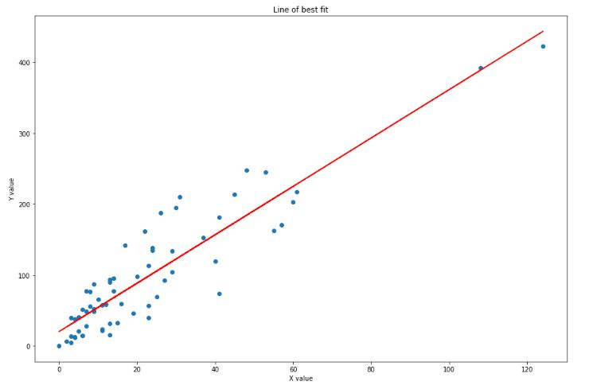
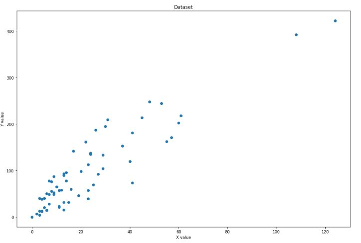

## What Is Regression?

Regression is a statistical measurement used in finance, investing, and other disciplines that attempts to determine the strength of the relationship between one dependent variable (usually denoted by Y) and a series of other changing variables (known as independent variables).

* <b>Dependent Variable:</b> This is the main factor that you’re trying to understand or predict.

* <b>Independent Variables:</b> These are the factors that you hypothesize have an impact on your dependent variable.

## Simple Linear Regression

<b>Linear Regression</b> is a machine learning algorithm based on supervised learning, this regression technique finds out a linear relationship between x (input) and y(output). Hence, the name is Linear Regression

## Simple Linear Equation:

                            Y(pred) = b0 + b1*x 
                            

